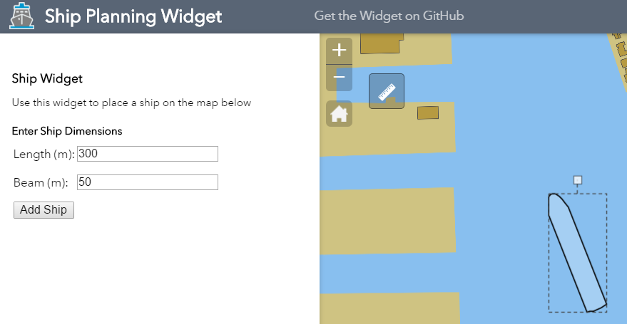

# ShipWidget

The Ship Planning Widget allows you to easily add a ship graphic to your Web AppBuilder application.  Because we've chosen to add the ship as a graphic, the ship can be rotated and moved across the map.  Also, if you're feeling *really crazy* multiple ships of varying sizes can be added to the map.  

If you want to see the Ship Planning Widget Live, [Click Here](https://dcdev.esri.com/shipplanning)

## Background
The purpose of this widget is to help users answer some of the following questions:
* Does the ship fit along a Quay Wall?
* Can multiple ships fit along a Quay Wall?
* At what bollard will this ship start/end along a Quay Wall?
* ...And more!

**Note**: The ship widget was developed for use in Web Mercator maps.

## Issues

Find a bug or want to request a new feature?  Please let us know by submitting an issue.

## Contributing

Anyone and everyone is welcome to contribute.
